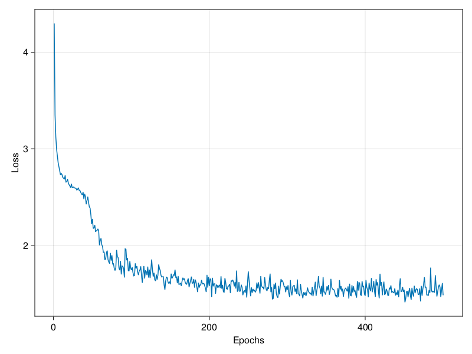
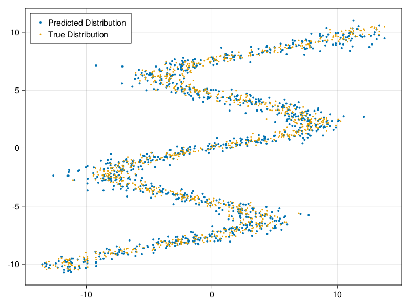

```@meta
CurrentModule = MixtureDensityNetworks
```

# MixtureDensityNetworks

This package provides a simple interface for defining, training, and deploying Mixture Density Networks (MDNs). MDNs were first proposed by [Bishop (1994)](https://publications.aston.ac.uk/id/eprint/373/1/NCRG_94_004.pdf). We can think of an MDN as a specialized type of Artificial Neural Network (ANN), which takes some features `X` and returns a distribution over the labels `Y` under a Gaussian Mixture Model (GMM). Unlike an ANN, MDNs maintain the full conditional distribution P(Y|X). This makes them particularly well-suited for situations where we want to maintain some measure of the uncertainty in our predictions. Moreover, because GMMs can represent multimodal distributions, MDNs are capable of modelling one-to-many relationships, which occurs when each input `X` can be associated with more than one output `Y`. 

# Example

First, let's create our dataset. To properly demonstrate the power of MDNs, we'll generate a many-to-one dataset where each x-value can map to more than one y-value.
```julia
using Flux, Distributions, CairoMakie, MixtureDensityNetworks

const n_samples = 1000
const epochs = 1000
const batchsize = 128
const mixtures = 8
const layers = [128, 128]

X, Y = generate_data(n_samples)

fig, ax, plt = scatter(X[1,:], Y[1,:], markersize=5)
```


Now we'll define a standard univariate MDN. For this example, we construct a network with 2 hidden layers of size 128, which outputs a distribution
with 5 Gaussian mixtures.
```julia
model = MixtureDensityNetwork(1, 1, layers, mixtures)
```

We can fit our model to our data by calling `fit!(m, X, Y; opt=Flux.Adam(), batchsize=32, epochs=100)`. We specify that we want to train our model for
500 epochs with the Adam optimiser and a batch size of 128. This method returns the model with the lowest loss as its first value and a named tuple 
containing the learning curve, best epoch, and lowest loss observed during training as its second value. We can use Makie's `lines` method to visualize
the learning curve.
```julia
model, report = MixtureDensityNetworks.fit!(model, X, Y; epochs=epochs, opt=Flux.Adam(1e-3), batchsize=batchsize)
fig, _, _ = lines(1:epochs, report.learning_curve, axis=(;xlabel="Epochs", ylabel="Loss"))
```



Let's evaluate how well our model learned to replicate our data by plotting both the learned and true distributions. We observe that our model
has indeed learned to replicate the true distribution.
```julia
Ŷ = model(X)
fig, ax, plt = scatter(X[1,:], rand.(Ŷ), markersize=4, label="Predicted Distribution")
scatter!(ax, X[1,:], Y[1,:], markersize=3, label="True Distribution")
axislegend(ax, position=:lt)
```



We can also visualize the conditional distribution predicted by our model at x = -2.1.
```julia
cond = model(reshape([-2.1], (1,1)))[1]
fig = Figure(resolution=(1000, 500))
density(fig[1,1], rand(cond, 10000), npoints=10000)
```


Below is a script for running the complete example.
```julia
using Flux, MixtureDensityNetworks, Distributions, CairoMakie

const n_samples = 1000
const epochs = 1000
const batchsize = 128
const mixtures = 8
const layers = [128, 128]

function main()
    # Generate Data
    X, Y = generate_data(n_samples)

    # Create Model
    model = MixtureDensityNetwork(1, 1, layers, mixtures)

    # Fit Model
    model, report = MixtureDensityNetworks.fit!(model, X, Y; epochs=epochs, opt=Flux.Adam(1e-3), batchsize=batchsize)

    # Plot Learning Curve
    fig, _, _ = lines(1:epochs, report.learning_curve, axis=(;xlabel="Epochs", ylabel="Loss"))
    save("LearningCurve.png", fig)

    # Plot Learned Distribution
    Ŷ = model(X)
    fig, ax, plt = scatter(X[1,:], rand.(Ŷ), markersize=4, label="Predicted Distribution")
    scatter!(ax, X[1,:], Y[1,:], markersize=3, label="True Distribution")
    axislegend(ax, position=:lt)
    save("PredictedDistribution.png", fig)

    # Plot Conditional Distribution
    cond = model(reshape([-2.1], (1,1)))[1]
    fig = Figure(resolution=(1000, 500))
    density(fig[1,1], rand(cond, 10000), npoints=10000)
    save("ConditionalDistribution.png", fig)
end

main()
```